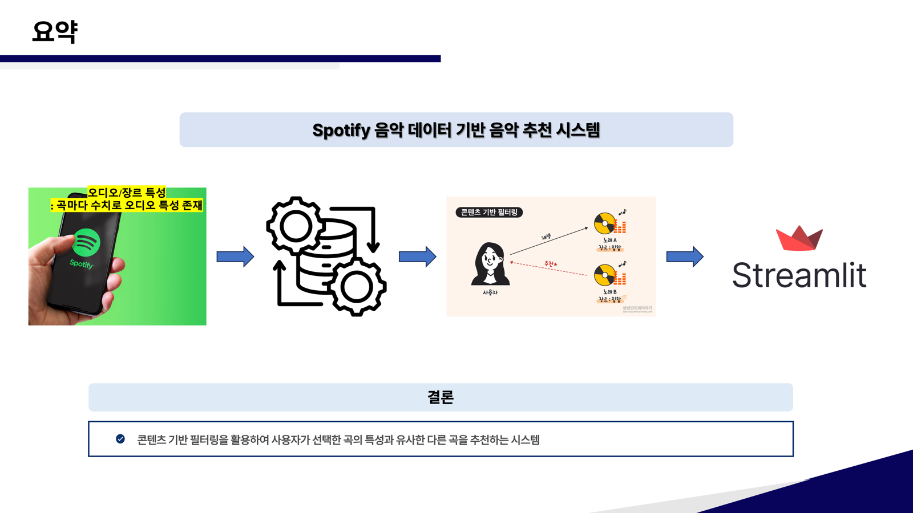
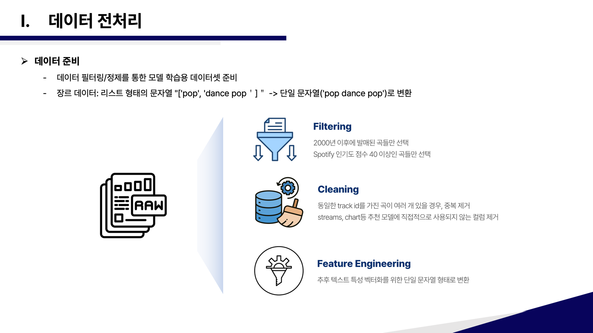
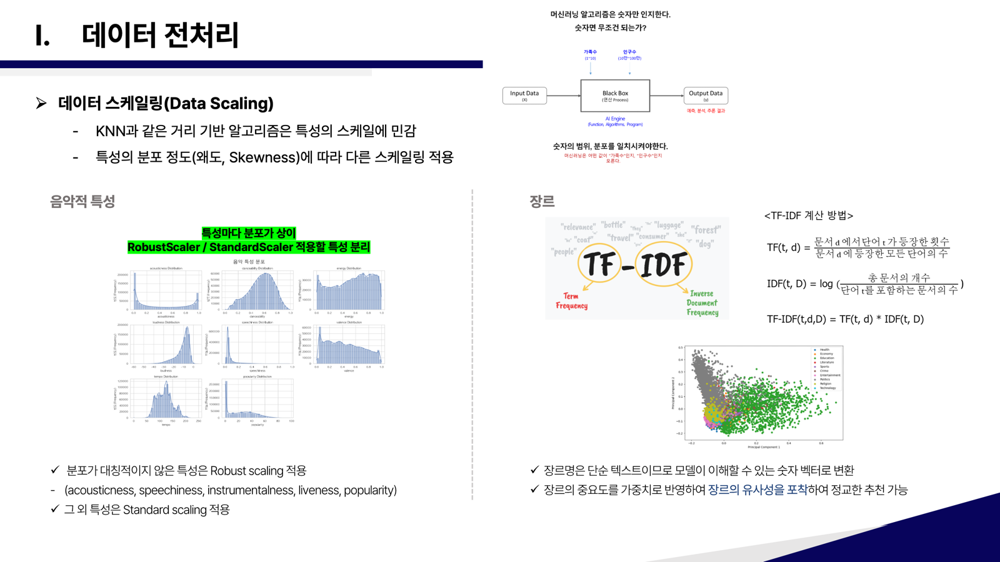
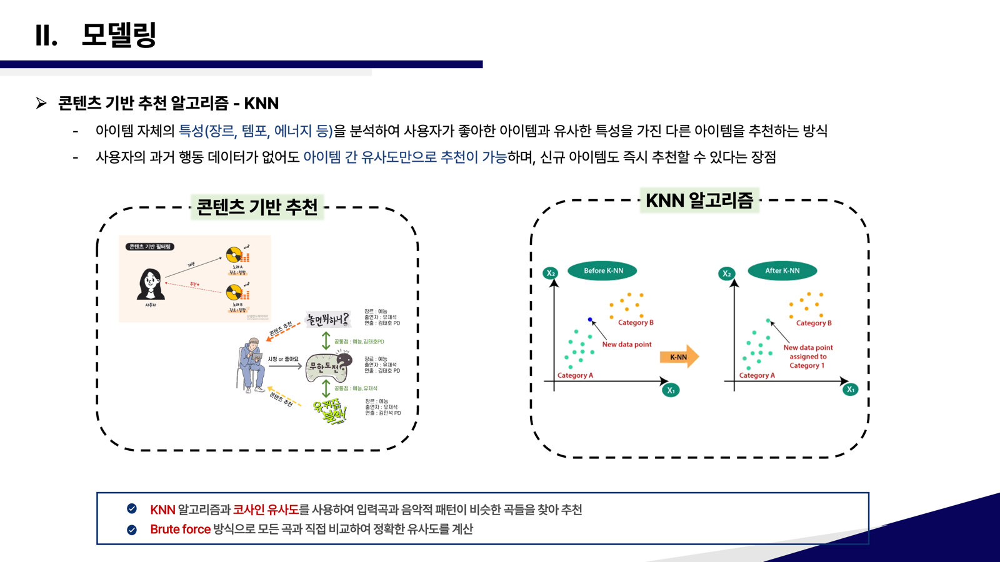
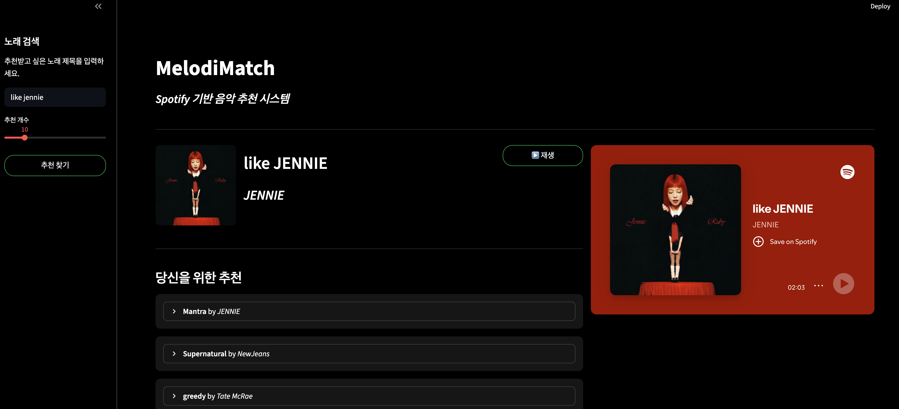

# Spotify 트랙 데이터 분석 프로젝트

## 👨‍👩‍👧‍👦 팀 소개
| 김종민 | 마한성 | 배상준 | 이인재 |
|:--:|:--:|:--:|:--:|
|  |  |  |  |


## 📋 WBS 

| 순번 | 진행 순서 | 담당자 | 예상 기간 | 산출물 |
|:----:|-----------|:------:|:---------:|--------|
| **1** | **프로젝트 기획 및 준비** | | | |
| 1-1 | 프로젝트 주제 선정 | 전체 팀 | 9/16-9/17 | 주제 확정 |
| 1-2 | 데이터셋 조사 및 선정 | 전체 팀 | 9/17-9/18 | 데이터셋 선정 |
| 1-3 | 주제 선정 | 전체 팀 | 9/17 | 주제 선정 |
| **2** | **탐색적 데이터 분석(EDA)** | | | |
| 2-1 | 결측치 및 이상치 탐색 | 전체 팀 | 9/18 | 결측치/이상치 분석 |
| 2-2 | 데이터 시각화 | 김종민, 배상준 | 9/18-9/22 | 데이터 시각화자료 |
| **3** | **데이터 정제 및 전처리** | | | |
| 3-1 | 담당 컬럼별 데이터 Standardscale/MinMaxscale 비교 | 전체 팀 | 9/19 | 데이터 처리 방법 |
| **4** | **ML 모델 개발** | | | |
| 4-1 | 콘텐츠 기반 추천 모델 설계 | 김종민 | 9/23 | 모델링 전략 확정 |
| 4-2 | 데이터 전처리 및 피처 엔지니어링 | 전체 팀 | 9/24 | 전처리 파이프라인 코드 |
| 4-3 | KNN 모델 학습 및 평가 | 전체 팀 | 9/25 | 학습된 모델 파일 (`.pkl`) |
| **5** | **Streamlit 애플리케이션 개발** | | | |
| 5-1 | Streamlit UI 프로토타입 설계 | 전체 팀 | 9/26 | UI 디자인 |
| 5-2 | ML 모델 연동 및 기능 구현 | 전체 팀 | 9/27 | Streamlit 앱 코드 |
| **6** | **최종 정리 및 발표 준비** | | | |
| 6-1 | 신규 데이터셋으로 모델 재생성 | 배상준 | 9/28 | 최종 모델 파일 |
| 6-2 | README 및 발표자료 최종 정리 | 김종민 | 9/28 | 최종 문서 |


## 🎈 프로젝트 주제 및 선정 배경

- Spotify 트랙 데이터 분석 프로젝트
프로젝트 개요: 
시대별 장르 선호도를 분석하기 위한 Spotify 트랙 데이터 EDA 프로젝트

- 프로젝트 주제 및 선정 배경
주제: 시대별 장르 선호도 변화 분석
1. 주제 및 데이터셋 선정 이유
* 주제 선정 배경
-스포티파이에서 제공하는 방대한 양의 데이터를 통해 여러 인사이트를 도출할 수 있을것을 기대하여 선정하게 되었습니다.

2. Spotify 데이터셋 선정 이유
* 방대한 데이터 규모

약 90만 개의 트랙 데이터로 충분한 샘플 사이즈 확보
다양한 시대(1900년대~2023년도)와 장르를 아우르는 포괄적인 데이터

* 풍부한 분석 변수

33개의 다양한 컬럼으로 다각도 분석 가능
음악적 특성 (tempo, energy, danceability, valence 등)부터 메타데이터까지 포함
장르, 인기도, 발매일 등 시계열 분석에 필요한 정보 보유

* 데이터 품질 및 접근성

Zenodo (유럽집행위원회, CERN 운영)에서 제공하는 신뢰할 수 있는 데이터 소스
구조화된 CSV 형태로 전처리 및 분석에 용이
결측치가 존재하지만 전체적으로 분석 가능한 수준의 데이터 완성도

* 높은 분석 활용도

시대별 트렌드 변화를 추적할 수 있는 시계열 데이터 구조
머신러닝 모델 적용을 위한 충분한 피처와 데이터 볼륨


## 📂 데이터셋

- **데이터명**: Almost a million Spotify tracks
- **데이터 크기**: 899,702개 트랙(row)
- **데이터 출처**: [Zenodo](https://zenodo.org/records/11453410) (유럽집행위원회 및 CERN 운영)
- **파일명**: `tracks.csv`


## 🎯 프로젝트 목표

각 특성을 분석하여 불필요한 column을 제거하고 비슷한 column은 합치고 scale의 변화등을 통해 EDA를 진행하며며 나아가
해당 특성들로 시대별 음악 장르의 선호도 변화를 통해 미래의 선호도를 예측하는 것.

### columns 설명

| 컬럼명 | 설명 | 데이터 타입 |
|--------|------|-------------|
| track_id | 트랙 고유 ID | object |
| name | 트랙의 제목 | object |
| album_name | 앨범 이름 | object |
| album_total_tracks | 트랙이 속한 앨범에 있는 전체 곡의 수 | float64 |
| chart | 트랙이 속한 차트의 이름 | object |
| track_track_number | 앨범 내의 트랙 번호 | float64 |
| track_album_album | 트랙이 속한 앨범의 유형 | object|
| genres | 장르 정보 | object |
| track_artists | 아티스트 이름 | object |
| artist_followers | 아티스트 팔로워 수 | float64 |
| artist_popularity | 아티스트 인기도 | float64 |
| popularity | 인기도 | float64 |
| streams | 스트리밍 횟수 | float64 |
| rank | 차트 내에서 트랙의 순위 | float64 | 
| trend | 순위 변화 | object |
| explicit | 부적절한 표현 여부 | object |
| energy | 에너지 수치 | float64 |
| tempo | 템포 | float64 |
| key | 트랙의 조(tonality) | float64 |
| mode | 트랙의 장/단조 | float64 |
| time_signature | 박자 | float64 |
| speechiness | 말소리(보컬, 랩등)의 비율 | float64 | 
| danceability | 댄스 가능성 | float64 |
| valence | 긍정도 | float64 |
| acousticness | 어쿠스틱(비전기 사운드) 정도 | float64 |
| liveness | 공연에서 녹음된 정도 | float64 |
| loudness | 음량 | float64 |
| instrumentalness | 보컬이 없는 정도 | float64 | 
| duration_ms | 재생 시간 | float64 |
| album_release_date | 앨범 발매일 | object |
| added_at | 트랙이 업로드 된 시점 | object |
| available_markets | 이용 가능 국가 | object |
| region | 지역 | object |


## 🔍 EDA 과정

### 1. 데이터 로드
```python
df = pd.read_csv('./data/tracks.csv')
```

### 2. 데이터 구조 확인
- `info()`: 전체 데이터 개수 및 결측치 확인
```
<class 'pandas.core.frame.DataFrame'>
RangeIndex: 899702 entries, 0 to 899701
Data columns (total 33 columns):
 #   Column              Non-Null Count   Dtype  
---  ------              --------------   -----  
 0   track_id            899702 non-null  object 
 1   streams             5870 non-null    float64
 2   artist_followers    892496 non-null  float64
 3   genres              892516 non-null  object 
 4   album_total_tracks  899701 non-null  float64
 5   track_artists       99943 non-null   object 
 6   artist_popularity   892516 non-null  float64
 7   explicit            899701 non-null  object 
 8   tempo               899224 non-null  float64
 9   chart               7040 non-null    object 
 10  album_release_date  899701 non-null  object 
 11  energy              899224 non-null  float64
 12  key                 899224 non-null  float64
 13  added_at            394649 non-null  object 
 14  popularity          899701 non-null  float64
 15  track_album_album   99997 non-null   object 
 16  duration_ms         7040 non-null    float64
 17  available_markets   899701 non-null  object 
 18  track_track_number  99997 non-null   float64
 19  rank                7040 non-null    float64
 20  mode                899224 non-null  float64
 21  time_signature      899224 non-null  float64
 22  album_name          899271 non-null  object 
 23  speechiness         899224 non-null  float64
 24  region              7040 non-null    object 
 25  danceability        899224 non-null  float64
 26  valence             899224 non-null  float64
 27  acousticness        899224 non-null  float64
 28  liveness            899224 non-null  float64
 29  trend               7040 non-null    object 
 30  instrumentalness    899224 non-null  float64
 31  loudness            899224 non-null  float64
 32  name                899215 non-null  object 
dtypes: float64(20), object(13)
memory usage: 226.5+ MB
```

- `describe()`: 기초 통계량 분석


- `columns`: 컬럼 정보 확인
Index(['track_id', 'streams', 'artist_followers', 'genres',
       'album_total_tracks', 'track_artists', 'artist_popularity', 'explicit',
       'tempo', 'chart', 'album_release_date', 'energy', 'key', 'added_at',
       'popularity', 'track_album_album', 'duration_ms', 'available_markets',
       'track_track_number', 'rank', 'mode', 'time_signature', 'album_name',
       'speechiness', 'region', 'danceability', 'valence', 'acousticness',
       'liveness', 'trend', 'instrumentalness', 'loudness', 'name'],
      dtype='object')


### 3. 결측치 및 이상치 탐색
- 결측치 분포 확인: `df.isnull().sum()`
- 이상치 탐지: `df.boxplot()`


- Boxplot상에는 이상치가 존재해보이나 인기도, 곡의 특성들을 고려했을때 이상치가 아니라고 판단


### 4. 데이터 시각화
> **히트맵 분석**


* `acousticness`와 `instrumentalness` 간 양의 상관관계 확인
* 두 컬럼 모두 다른 컬럼들과 전체적으로 음의 상관관계


> **음악의 특성 분포(Histogram)**


* acousticness가 양 끝 값에 치중된 이유
    - 클래식이나 전자 사운드를 사용하기 전의 음악일 가능성이 있음.
    - 최신곡의 경우 전자 사운드를 대부분 쓰는 경우도 있음.
* loudness가 치우친 정규분포의 형태를 띔
    - 특별히 선호되고 듣기 좋은 음량의 구간이 정해져 있음을 유추 가능.
* speechiness는 0.07정도에서 높은 빈도를 나타냄
    - 선호되는 speechiness의 정도가 있음. 혹은 음악의 특성상 이를 크게 벗어날 수 없음.
* tempo는 120~140 구간이 최다 빈도를 띔
    - 이 구간에 해당하는 BPM을 가진 장르는 팝, 힙합, EDM이 다수.


> **시대별 음악의 특성 변화**


* 1920년대 key와 tempo의 급격한 상승
    - 미국 흑인사회를 중심으로 재즈음악의 급성장 - 재즈 시대(Jazz Age)
    - 1차 세계대전 이후 미국이 세계 강대국으로 호황을 누리던 황금기 - 광란의 20년대(Roaring 20s)
    - 복잡한 멜로디와 빠른 템포를 가진 신나는 곡
* 1940년대 부근에 급격한 감소 - loudness, tempo
    - 2차 세계대전의 영향일 가능성
    - 전쟁으로 인해 기존의 밴드 음악에서 감성적인 발라드 음악이 유행
* 1960년대 이후부터 loudness, tempo 상승
    - 록(Rock) 음악의 유행으로 강렬한 에너지와 빠른 비트가 대중문화를 지배
* 1990년대 이후 가사에 비속어 포함 급증
    - 스트리밍 서비스 등장: 방송국에서 틀어주는 검열된(Censored) 음악에서 자기가 직접 찾아듣는 시대
    - 갱스터 랩 & 힙합의 유행: 기성세대에 대한 반항과 강렬한 사회적 메세지를 담는 기조
* `loudness`(음량)와 `acousticness`(어쿠스틱함) 반비례 관계 -어쿠스틱함이란 **앰프나 전자 장치 없이 자연적인 음향적 수단, 즉 악기 본연의 울림을 통해 소리를 내는 상태나 특성**을 의미합니다, 즉, 앰프나 전자 장치의 활용의 증가로 어쿠스틱함이 줄어들고 그에 따라 음량은 커졌다고 해석할 수 있음

> **상위 5% 인기곡(popularity) 특성 시각화**


<div align="center">
 
</div>

> **시대별 장르의 트렌드 및 상위 5% 장르 트렌드**
<div align="center">

</div>

<div align="center">
- 2010년대에 Pop의 인기가 급격히 올라갔고 2020년대에도 여전히 인기가 있지만 다른 장르들도 관심도가 올라간 것을 알 수 있음
</div>

<div align="center">

</div>

- 전체 트렌드 추이와 상위 인기곡 트렌드 추이가 모양이 유사
 - 90년대엔 전체 표본에서는 Classical 장르가 많았으나 상위 인기곡은 Rock이 지배함
 - 90년대에 유행했던 클래식과 현대음악을 조합하는 형태인 Classical Crossover의 영향으로 보임
 → 한국에서는 ‘팝페라’라는 단어로 알려짐

> **상위 10위 아티스트**


> **스타 파워와 인기도 상관관계**


아티스트의 인기(스타 파워)와 곡 자체의 인기는 항상 비례할까?

- 해당 값들은 각 아티스트의 곡별 인기도를 나타냄
  
- 아티스트의 명성도는 인기도와 대체로 비례함
- 팔로워 수와 인기도는 명확한 관계가 보이지 않음
    - 곡 자체의 인기와 아티스트에 대한 팬심은 별개인듯
    - 가수의 팬이 아니라도 노래는 얼마든지 들을 수 있음
    - 팔로우가 많다고 노래가 인기 있는 것은 아님


### 5. 데이터 정제
> **불필요한 컬럼 결정**

* streams: 스트리밍 횟수 - popularity와 겹치는 column, 결측치 과다(5,870/899,702)

* album_total_tracks: 앨범의 총 트랙 수 

* chart: 차트 정보

* available_markets: 서비스 가능 국가/지역

* region: 지역(나라)

* mode(삭제후 ML시 필요하면 사용) - 장/단조

* track_id: 트랙의 고유 ID

* album_name: 앨범 이름

* rank: 곡 순위 - 전체 column의 1%가 안되는 수치

* track_track_number: 앨범 내 트랙 번호

* time_signature: 박자 
  - tempo 겹치는 컬럼이고 정확히 무엇을 뜻하는지 모름
  - 차원의 저주 완화

* duration_ms: 곡의 길이 - 결측치 99.2%

* trend - 차트 내에서 순위 변화 - 분석에 불필요

* added_at - added_at이 row가 적고 비슷한 column인 album_release_date이 더 major하다고 판단

* album_release_date - 연-월-일로 된 데이터여서 year로 연도만 나오고 바꿔서 사용

df.drop(['streams', 'album_total_tracks', 'chart', 'available_markets', 'region', 'mode', 'track_id', 'album_name', 'track_track_number', 'rank', 'track_artists', 'duration_ms', 'trend', 'track_album_album', 'added_at', 'name', 'time_signature'], axis=1)

## 💡 EDA를 통해 얻은 인사이트 및 모델링 방향 설정

EDA 과정을 통해, 저희는 `loudness`, `energy`와 같은 오디오 특성들이 시대별로 뚜렷한 변화를 보이며, `popularity`와도 유의미한 관계를 맺고 있음을 확인했습니다. 또한, 장르(genre) 정보가 곡의 정체성을 나타내는 중요한 요소임을 파악했습니다.

이러한 분석 결과를 바탕으로, 저희는 이 **오디오 특성들과 장르 정보를 핵심 피처로 사용하여** 사용자가 선택한 곡과 유사한 곡을 추천하는 **콘텐츠 기반 추천 모델**을 구축하기로 결정했습니다.

---

*이 프로젝트는 시대별 음악 트렌드 변화를 데이터 과학적 방법론으로 분석하고, 이를 기반으로 음악 추천 시스템을 구축하는 것을 목표로 합니다.*

---

## 🤖 추천 모델 개발 (ML Modeling)

EDA를 통해 얻은 인사이트를 바탕으로, 음악의 오디오 특성과 장르 정보를 활용한 콘텐츠 기반 추천 모델을 개발했습니다.

### 1. 시스템 아키텍처

*(데이터 정제, 모델 학습, Streamlit을 통한 추천까지의 전체 과정을 보여주는 흐름도)*

### 2. 모델링 상세 과정

#### 2.1. 데이터 준비 (Data Preparation)
- 원본 데이터셋에서 2000년 이후 발매되고 인기도 40 이상인 곡들만 필터링하여 최신 트렌드를 반영하는 학습용 데이터셋(`tracks_2000_2025.csv`)을 구축했습니다.
  


#### 2.2. 특성 공학 및 전처리 (Feature Engineering & Preprocessing)
- **핵심 전략**: KNN과 같은 거리 기반 알고리즘은 특성의 스케일에 민감하므로, 각 특성의 분포에 맞는 최적의 스케일링 및 인코딩 전략을 적용했습니다.
    - **왜도 기반 스케일링**: 데이터의 왜도(skewness)를 측정하여, 분포가 대칭적인 특성(`energy`, `danceability` 등)에는 `StandardScaler`를, 한쪽으로 치우친 특성(`popularity`, `acousticness` 등)에는 이상치의 영향을 덜 받는 `RobustScaler`를 적용했습니다.
    - **장르 벡터화**: `TfidfVectorizer`를 사용하여 'pop'처럼 일반적인 장르보다 'minimal-techno'처럼 곡의 개성을 잘 나타내는 희귀 장르에 더 높은 가중치를 부여했습니다.

- **전처리 파이프라인 코드 (`ColumnTransformer`)**:
  ```python
  # ml/recommendation.py
  preprocessor = ColumnTransformer(
      transformers=[
          ('normal', StandardScaler(), normal_features),
          ('robust', RobustScaler(), robust_features),
          ('cat', OneHotEncoder(handle_unknown='ignore'), categorical_features),
          ('tfidf', TfidfVectorizer(stop_words='english', max_features=300), 'track_genre')
      ],
      remainder='drop'
  )
  ```
  


#### 2.3. 모델링 및 순위 결정 (Modeling & Ranking)
- **알고리즘**: `K-Nearest Neighbors (KNN)`
    - **주요 파라미터 및 선택 근거**:
        - `metric='cosine'`: 벡터의 크기보다 방향성에 초점을 맞추는 **코사인 유사도**를 사용하여, 여러 특성으로 이루어진 고차원 공간에서 두 곡의 프로파일이 얼마나 유사한지를 효과적으로 측정합니다.
        - `algorithm='brute'`: 데이터셋의 크기가 수십만 단위로, 정확성을 100% 보장하는 `brute-force` 방식이 근사 알고리즘(`KD-Tree` 등)보다 합리적이라고 판단했습니다.

- **최종 순위 결정 로직**:
  단순히 음악적 유사도만으로 순위를 매기지 않고, **유사도 점수(90%)**와 **대중적 인기도(10%)**를 가중 합산하여 사용자의 만족도를 높일 수 있는 최종 추천 목록을 생성합니다.
  > `Final Score = (0.9 * Cosine Similarity) + (0.1 * Normalized Popularity)`
  


### 3. 한계점 및 향후 과제
- **한계점**: 사용자 개인의 청취 이력이나 취향 변화를 반영하지 못하고, 데이터셋에 없는 최신 곡은 추천할 수 없는 '콜드 스타트' 문제가 있습니다.
- **향후 과제**: 협업 필터링(Collaborative Filtering)을 결합한 하이브리드 모델을 구축하여 개인화 추천을 강화하고, A/B 테스트 환경을 도입하여 모델 성능을 지속적으로 측정하고 개선해나갈 계획입니다.

### 4. 사용자 피드백 및 평가

프로토타입 버전에 대해 총 14명의 사용자를 대상으로 만족도 평가를 진행했습니다.

- **종합 평가**: **평균 3.7점 / 5.0점**
- **점수 분포**: 5점 만점(2명), 4점(6명), 3점(5명), 2점(1명)

#### 결과 분석 (고찰)
평균 3.7점이라는 긍정적인 평가를 통해, **음악 특성에 기반한 추천이라는 핵심 기능의 가능성**을 확인했습니다. 5점 만점을 준 사용자들은 추천 결과가 자신의 숨겨진 취향을 잘 찾아주었다고 평가했습니다.

#### 개선 방향
이러한 사용자 피드백을 바탕으로, 저희는 다음 두 가지 방향으로 모델을 고도화할 계획입니다.

1.  **하이브리드 추천 모델 도입 (feat. 협업 필터링)**
    - **문제점**: 현재의 콘텐츠 기반 필터링은 '비슷한 특성의 곡'만 추천하므로, 사용자의 잠재적 취향이나 새로운 트렌드를 반영하기 어려움.
    - **개선안**: **협업 필터링(Collaborative Filtering)**을 도입하여, "나와 비슷한 취향의 다른 사용자들이 좋아하는 음악"을 함께 추천하는 **하이브리드 모델**로 확장
    - **기대 효과**: 개인화된 추천을 통해 만족도를 높이고, 우연히 좋은 곡을 발견하는 만족감을 제공하여 3-4점대 사용자의 경험을 개선

2.  **사용자 피드백 루프(Feedback Loop) 구축**
    - **문제점**: 현재 시스템은 사용자의 반응을 학습하지 못하는 일방향적 추천입니다.
    - **개선안**: Streamlit 앱에 추천 결과에 대한 **'좋아요/싫어요' 버튼을 추가**합니다.
    - **기대 효과**: 수집된 사용자 피드백을 다음 추천에 즉시 반영하거나, 주기적으로 모델을 재학습시키는 데 사용하여, 사용할수록 똑똑해지는 인터랙티브 추천 시스템으로 발전시킬 수 있습니다.

## 🖥️ Streamlit 애플리케이션

Streamlit을 사용하여 구축된 웹 애플리케이션은 사용자가 쉽고 직관적으로 음악 추천을 받을 수 있는 UI를 제공합니다.

### 1. 주요 기능 및 화면 흐름
1.  **검색**: 사이드바에서 추천받고 싶은 노래의 제목을 입력합니다.
2.  **선택**: 검색된 노래가 여러 버전일 경우, 원하는 버전을 선택합니다.
3.  **추천**: '추천받기' 버튼을 누르면, 선택한 곡을 기반으로 한 추천 목록이 메인 화면에 나타납니다.
4.  **재생**: 추천 목록의 각 곡 옆에 있는 '재생' 버튼을 누르면, 오른쪽에 고정된 Spotify 플레이어를 통해 음악을 즉시 감상할 수 있습니다.


*(Streamlit 앱 실행 화면 스크린샷)*

### 2. 실행 방법
프로젝트의 루트 디렉토리에서 아래 명령어를 입력하여 애플리케이션을 실행할 수 있습니다.

```bash
streamlit run streamlit/updated_home.py
```


## 🛠️ 사용 기술

- **언어**: Python
- **데이터 분석**: pandas, numpy, matplotlib, seaborn
- **ML 모델링**: scikit-learn
- **웹 애플리케이션**: Streamlit
- **개발 환경**: Jupyter Notebook, VSCode

## 📝 팀원 회고

| 이름 | 회고 |
|------|------|
| 김종민 | 스포티파이 데이터로 콘텐츠 기반 음악 추천 시스템을 구축하면서, 데이터 전처리의 중요성과 사용자 관점에서의 기능 설계가 얼마나 중요한지 깊이 체감했습니다. 특히 KNN과 코사인 유사도를 활용한 추천 알고리즘 구현 과정에서 이론과 실제 구현 사이의 간극을 메우는 경험을 할 수 있었고, 향후 협업 필터링을 추가한 하이브리드 모델로 발전시켜보고 싶습니다. |
| 마한성 | 이번 프로젝트에서는 90만 개의 Spotify 트랙 데이터를 활용하여 시대별 음악 트렌드를 분석하고 콘텐츠 기반 추천 시스템을 구축했습니다. Streamlit으로 실제 사용 가능한 웹 애플리케이션까지 완성하여 14명의 사용자 평가에서 평균 3.7/5.0점을 받았으나, 이상치 처리 과정에서 구체적인 검증이 부족했습니다. 이 과정에서 음악 이론과 역사적 맥락에 대한 도메인 지식이 데이터 해석의 깊이를 좌우함을 체감했습니다. 이론적 분석에서 그치지 않고 실제 사용자가 체험할 수 있는 서비스까지 구현하였습니다. |
| 배상준 | (회고 내용을 작성해주세요) |
| 이인재 | (회고 내용을 작성해주세요) |
